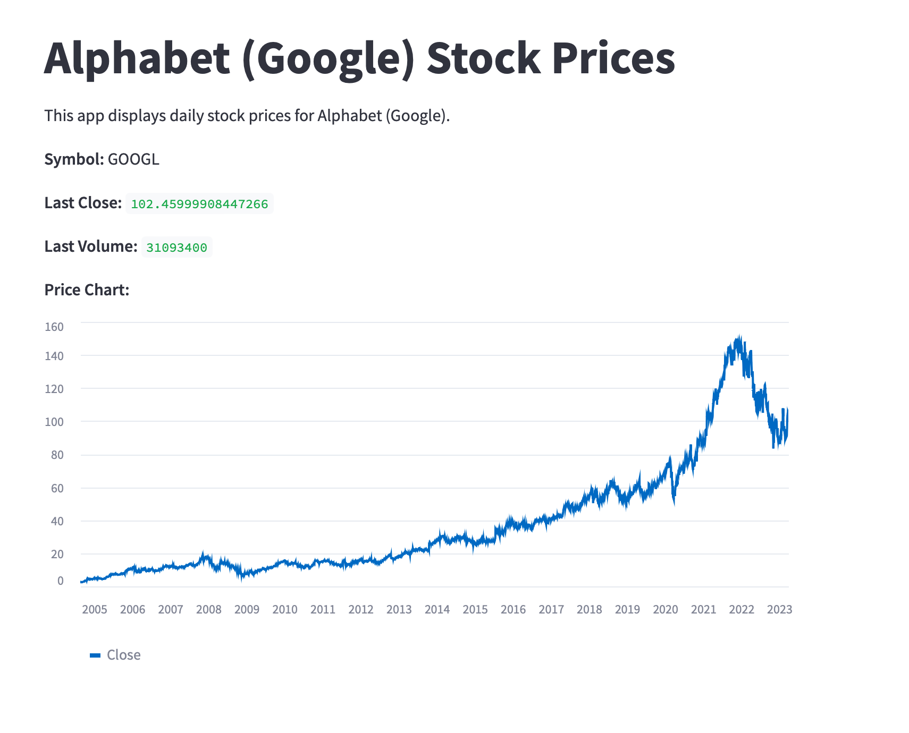

# Example streamlit application 

This is an example application that demonstrates usage of Streamlit.

This Python program that retrieves stock data of Alphabet (Google) from the Yahoo Finance API and displays the daily stock prices in a Streamlit app.

## Prerequisites
Before you can run this program, you need to have the following installed on your machine:

Python 3.6 or later
pip (the Python package manager)

## Installation

    python -m venv env
    
    env\Scripts\activate.bat
    
    pip install -r requirements.txt

## Installation

To use this program, follow these steps:

Open a terminal or command prompt.

Clone this repository to your local machine:

    git clone https://github.com/manujoha/streamlit_example
    
    cd streamlit_example

    python -m venv env
    
    env\Scripts\activate.bat
    
    pip install -r requirements.txt

## Running app

Open a terminal or command prompt.

    streamlit run main.py

Open a web browser and go to http://localhost:8501. 

You should see the Streamlit app displaying the daily stock prices for Alphabet (Google).

